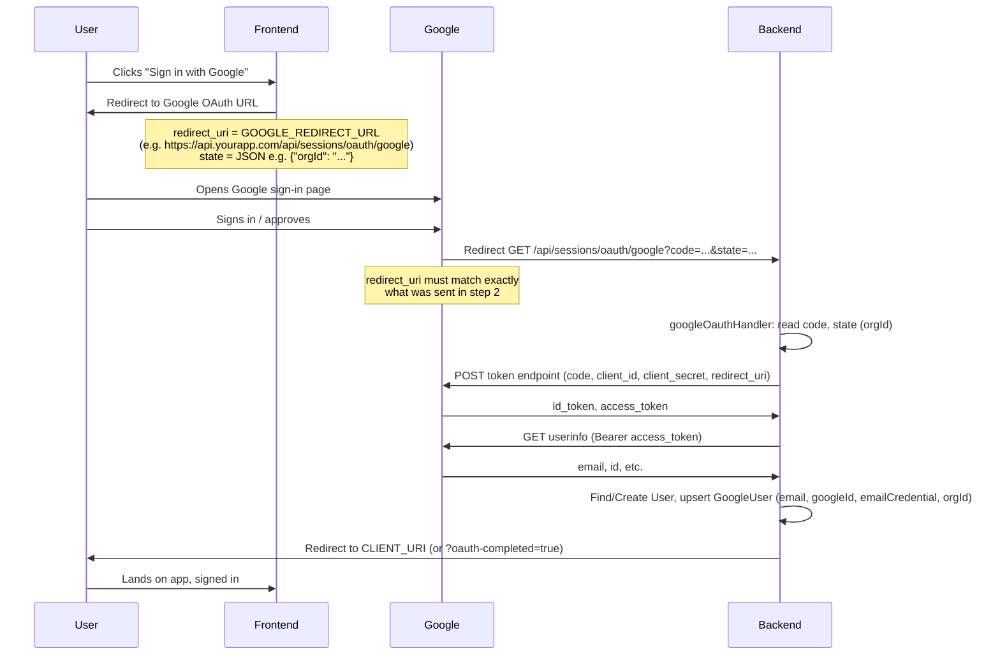
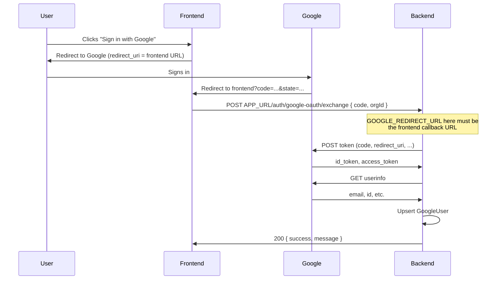
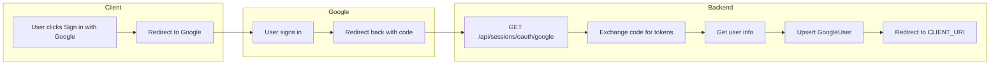

# Google OAuth Flow

## Flow 1: Session OAuth (redirect-based)

Used when the frontend sends the user to Google and the **backend** is the callback URL (`GET /api/sessions/oauth/google`).

---

## Flow 2: Code exchange (POST)

Used when the frontend uses its **own** redirect URL; after Google redirects to the frontend with `?code=...`, the frontend POSTs the code to the backend.

---

## High-level process (single diagram)

---

## Env variables

| Variable               | Purpose                                                                                     |
| ---------------------- | ------------------------------------------------------------------------------------------- |
| `GOOGLE_REDIRECT_URL`  | Exact callback URL (backend for Flow 1, or frontend for Flow 2). Must match Google Console. |
| `GOOGLE_CLIENT_ID`     | OAuth client ID from Google Console.                                                        |
| `GOOGLE_CLIENT_SECRET` | OAuth client secret.                                                                        |
| `CLIENT_URI`           | Where to send the user after OAuth (your frontend app URL).                                 |
| `APP_URL`              | Base URL for API routes (e.g. used in Flow 2 path).                                         |

---

## Important for redirect_uri_mismatch

- **Flow 1:** `GOOGLE_REDIRECT_URL` = `https://<your-backend>/api/sessions/oauth/google`
- That **exact** string must be added in **Google Cloud Console → Credentials → OAuth 2.0 Client → Authorized redirect URIs**.
- The `redirect_uri` the frontend sends when building the Google login link must be the **same** as `GOOGLE_REDIRECT_URL` (and in Console).
