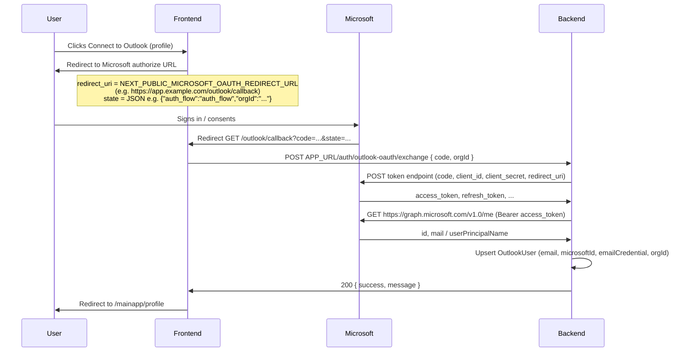

# Microsoft Outlook OAuth (main app)

This documents the **frontend callback + backend code exchange** flow used by the Next.js app for connecting an organization’s mailbox via Microsoft identity (Outlook / Microsoft 365 Graph), parallel to the Gmail flow described in [google-oauth-flow.md](./google-oauth-flow.md).

## Sequence

## Verify and disconnect

- **Verify:** `POST APP_URL/auth/outlook-login-verify` (authenticated) — returns whether an `OutlookUser` exists for the caller’s organization.
- **Disconnect:** `POST APP_URL/auth/outlook-login/disconnect` (authenticated) — removes the org’s Outlook connection record.

## Environment variables

### Backend

| Variable | Purpose |
| -------- | ------- |
| `MICROSOFT_CLIENT_ID` | App registration (client) ID in Azure Entra ID. |
| `MICROSOFT_CLIENT_SECRET` | Client secret for the confidential client app. |
| `MICROSOFT_REDIRECT_URL` | Must **exactly** match the redirect URI used in the authorize request (same value as `NEXT_PUBLIC_MICROSOFT_OAUTH_REDIRECT_URL` on the frontend). |

### Frontend

| Variable | Purpose |
| -------- | ------- |
| `NEXT_PUBLIC_MICROSOFT_CLIENT_ID` | Same client ID as the backend (public in the browser). |
| `NEXT_PUBLIC_MICROSOFT_OAUTH_REDIRECT_URL` | Full URL to the Next.js route `/outlook/callback` (scheme, host, path; no trailing slash unless your app expects it). |

## Azure app registration

1. Register an **Web** application in Microsoft Entra ID (Azure AD).
2. Add a **client secret** (for confidential client).
3. Under **Authentication**, add a **Redirect URI** of type **Web** with the same value as `MICROSOFT_REDIRECT_URL` / `NEXT_PUBLIC_MICROSOFT_OAUTH_REDIRECT_URL` (for example `https://your-domain.com/outlook/callback` and `http://localhost:3000/outlook/callback` for local dev).
4. Grant **API permissions** (Microsoft Graph, delegated): at minimum `openid`, `profile`, `email`, `offline_access`, `User.Read`, `Mail.Read`, `Mail.ReadWrite` (aligned with the scopes requested in the frontend authorize URL).

## Redirect URI mismatch

The string Microsoft redirects to after login must match **both** the authorize request’s `redirect_uri` and the token exchange `redirect_uri` on the backend, and must be listed in the Azure app registration.
