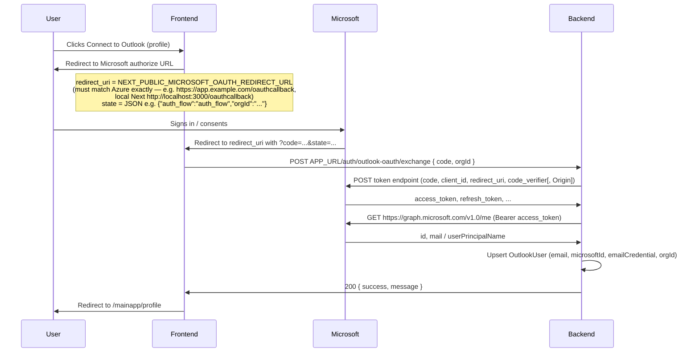

# Microsoft Outlook OAuth (main app)

This documents the **frontend callback + backend code exchange** flow used by the Next.js app for connecting an organization’s mailbox via Microsoft identity (Outlook / Microsoft 365 Graph), parallel to the Gmail flow described in [google-oauth-flow.md](./google-oauth-flow.md).

## Sequence


```mermaid
sequenceDiagram
    participant User
    participant Frontend
    participant Microsoft
    participant Backend

    User->>Frontend: Clicks Connect to Outlook (profile)
    Frontend->>User: Redirect to Microsoft authorize URL
    Note over Frontend: redirect_uri = NEXT_PUBLIC_MICROSOFT_OAUTH_REDIRECT_URL<br/>(must match Azure exactly — e.g. https://app.example.com/oauthcallback,<br/>local Next http://localhost:3000/oauthcallback)<br/>state = JSON e.g. {"auth_flow":"auth_flow","orgId":"..."}

    User->>Microsoft: Signs in / consents
    Microsoft->>Frontend: Redirect to redirect_uri with ?code=...&state=...

    Frontend->>Backend: POST APP_URL/auth/outlook-oauth/exchange { code, orgId }
    Backend->>Microsoft: POST token endpoint (code, client_id, redirect_uri, code_verifier[, Origin])
    Microsoft->>Backend: access_token, refresh_token, ...

    Backend->>Microsoft: GET https://graph.microsoft.com/v1.0/me (Bearer access_token)
    Microsoft->>Backend: id, mail / userPrincipalName

    Backend->>Backend: Upsert OutlookUser (email, microsoftId, emailCredential, orgId)
    Backend->>Frontend: 200 { success, message }

    Frontend->>User: Redirect to /mainapp/profile
```

## Verify and disconnect

- **Verify:** `POST APP_URL/auth/outlook-login-verify` (authenticated) — returns whether an `OutlookUser` exists for the caller’s organization.
- **Disconnect:** `POST APP_URL/auth/outlook-login/disconnect` (authenticated) — removes the org’s Outlook connection record.

## Organization API for agent tools (Python / CoWorkr AI Agent)

The custom agent fetches Microsoft tokens the same way it does for Gmail: **`GET APP_URL/organization/microsoft-users`** with the **same middleware** as [`google-users`](./google-oauth-flow.md) (organization JWT in query: `token`, plus `email` and optional `from_email`).

| Query param  | Purpose                                                                                                |
| ------------ | ------------------------------------------------------------------------------------------------------ |
| `token`      | JWT identifying the org user (required; validated by `verifyGoogleAuthUser`).                          |
| `email`      | Present for parity with the Gmail endpoint; the handler uses `req.user` from the token.                |
| `from_email` | Optional. When set, only the `OutlookUser` row matching this mailbox for the organization is returned. |

**Response `data`:**

- `user_email` — email of the authenticated user.
- `orgMicrosoftCredential` — `{ client_id, client_secret, secret_id, tenant_id, redirect_url }` from env (`MICROSOFT_*`), used with stored refresh tokens for Graph token refresh and Origin derivation.
- `connectedOutlooks` — list of Outlook connections for the org (each includes `email`, `emailCredential`, `granted_scope`, etc.).

The Python agent mirrors the Gmail tools pattern (`gmail_outreach`): read, draft, and send via Microsoft Graph using these credentials.

### Refresh-token rotation write-back

Unlike Google, **Entra ID rotates refresh tokens**: every `refresh_token` grant returns a *new* refresh token, and the stored one eventually expires (90-day inactivity limit; `AADSTS700082 invalid_grant`). After each successful refresh the agent must persist the new token response:

**`POST APP_URL/organization/microsoft-users/credentials`** — same auth contract as `microsoft-users` (org JWT in query `token`, plus `orgId`), body:

```json
{ "from_email": "<mailbox>", "emailCredential": { ...full token response... } }
```

The agent refresh call itself is a plain confidential-client request — `POST https://login.microsoftonline.com/{tenant}/oauth2/v2.0/token` with `client_id`, `client_secret`, `grant_type=refresh_token`, `refresh_token`, `scope` — no `Origin` header.

## Environment variables

### Backend

| Variable                  | Purpose                                                                                                                                           |
| ------------------------- | ------------------------------------------------------------------------------------------------------------------------------------------------- |
| `MICROSOFT_CLIENT_ID`     | App registration (client) ID in Azure Entra ID.                                                                                                   |
| `MICROSOFT_CLIENT_SECRET` | **Required.** The redirect URI is registered under the Web (confidential) platform, so every token request — code exchange and refresh — must include it. |
| `MICROSOFT_REDIRECT_URL`  | Must **exactly** match the redirect URI used in the authorize request (same value as `NEXT_PUBLIC_MICROSOFT_OAUTH_REDIRECT_URL` on the frontend). |

### Frontend

| Variable                                   | Purpose                                                                                                              |
| ------------------------------------------ | -------------------------------------------------------------------------------------------------------------------- |
| `NEXT_PUBLIC_MICROSOFT_CLIENT_ID`          | Same client ID as the backend (public in the browser).                                                               |
| `NEXT_PUBLIC_MICROSOFT_OAUTH_REDIRECT_URL` | Full redirect URI registered in Azure (e.g. Next dev `http://localhost:3000/oauthcallback`). Must match **exactly**. |

## Azure app registration

1. Register an **Web** application in Microsoft Entra ID (Azure AD).
2. Add a **client secret** (for confidential client).
3. Under **Authentication**, add a **Redirect URI** under the **Web** platform (NOT "Single-page application") with the same value as `MICROSOFT_REDIRECT_URL` / `NEXT_PUBLIC_MICROSOFT_OAUTH_REDIRECT_URL` (for example production `https://your-domain.com/oauthcallback`; local Next `http://localhost:3000/oauthcallback`). If the URI is currently listed under the SPA platform, **remove it there first** — SPA-platform tokens can only be redeemed via cross-origin browser requests (`AADSTS9002327`) and their refresh tokens hard-expire after 24 hours, which breaks the server-side agent.
4. Grant **API permissions** (Microsoft Graph, delegated): at minimum `openid`, `profile`, `email`, `offline_access`, `User.Read`, `Mail.Read`, `Mail.ReadWrite`, `Mail.Send` (aligned with the scopes requested in the frontend authorize URL; `Mail.Send` is required for the agent's outreach send step).

## Redirect URI mismatch

The string Microsoft redirects to after login must match **both** the authorize request’s `redirect_uri` and the token exchange `redirect_uri` on the backend, and must be listed in the Azure app registration.

## PKCE (Proof Key for Code Exchange)

The main Next.js app sends **`code_challenge`** / **`code_challenge_method=S256`** on the authorize request and stores a **`code_verifier`** in `sessionStorage`. The `/oauthcallback` page posts **`code_verifier`** to `POST .../auth/outlook-oauth/exchange` with the **`code`**.

Backend exchange behavior:

- Always sends `client_secret` (Web/confidential platform requires it on every redemption).
- Sends `code_verifier` alongside it when present (PKCE and client_secret are complementary, not exclusive).
- Never sends an `Origin` header — that was a workaround for the redirect URI being misregistered under the SPA platform, which issued 24-hour SPA refresh tokens the Python agent could not redeem (`AADSTS9002327`).

Server logs: `[Microsoft token]` and `outlookOauthCodeExchange` print the Microsoft error JSON on failure. Browser DevTools: `[Outlook OAuth]` logs each step.
